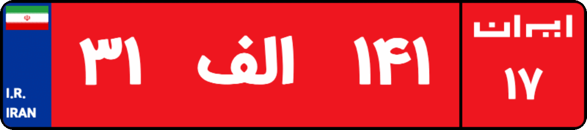

# Iran Lisence Plate


[](https://GitHub.com/MajidAlinejad/Iran-License-Plate/contributors/)
[](https://github.com/MajidAlinejad/Iran-License-Plate/blob/master/LICENSE)
[](https://github.com/MajidAlinejad/Iran-License-Plate/compare)


<br />
<div align="center">
  
</div>
<br />
<br />

Iran Lisence Plate is a `React Component` based on `Typescript` to display Iran car plaque appropriately depending on the serial number.

## Features

- ⚛ React Component.
- ☑ Typescript.
- 👌 Validating license serial.
- 🎈 Include free city license plate.
- 📐 Responsive and mobile friendly.
- 🌈 Colorize plate.

## Installation

This module is distributed via npm which is bundled with node and should be installed as one of your project's `dependencies`:

```
npm i iran-license-plate
```

> This package also depends on `react`. Please make sure you have it installed
> as well.

**🚨Shortcut: you can see all options by visiting : [storybook](https://majidalinejad.github.io/Iran-License-Plate/)🚨**

## Usage

```JSX
import IranLicensePlate from "iran-license-plate";

function App() {
    return (
        <div>
            <IranLicensePlate serial="IR15-546T55" />
        </div>
    );
}
```

## Avalilible Params

| property    | type                  | description                                                                                                           |
| ----------- | --------------------- | --------------------------------------------------------------------------------------------------------------------- |
| `isLoading` | `boolean`/`undefined` | isshow loading indicator                                                                                              |
| `isUnknown` | `boolean`/`undefined` | preserve unknown situation                                                                                            |
| `serial`    | `string`              | the serial number of license plate for all options please visit : https://majidalinejad.github.io/Iran-License-Plate/ |

## Contributors

<a href="https://github.com/MajidAlinejad"  >

</a>

This project follows the all contributors specification.
Contributions of any kind welcome!

</br>

**_Documented with :_**
<br>


<br>

## WIKI PAGE

for more information please visit [wiki page ](https://github.com/MajidAlinejad/Iran-License-Plate/wiki)

## LICENSE

MIT
